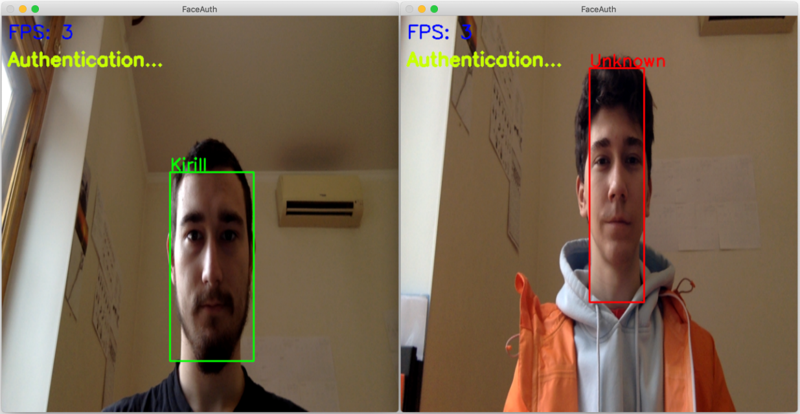
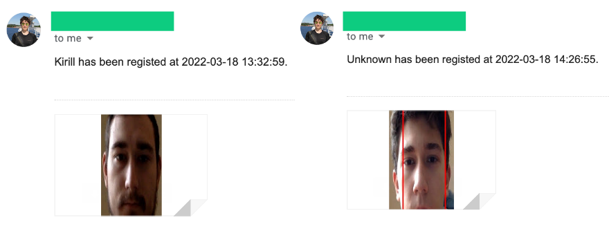

</img>
# FaceAuth
A small authentication program that may be tuned for various purposes from face door unlock to a more complex authorization system.

## FaceAuth in action
### Face detection and authentication

### Notification or authorization (or any other action)

## How does it work?
The Face Authenticator system consists of three subsystems:
1. Face detection
2. Face authentication
3. Notification or authorization

The first subsystem detects and tracks the closest face to the camera and ignores others. Such behaviour may be adjusted through a variable. Therefore, faces that take up 70% of the frame size are further sent to the authentication subsystem. It is programmed to do so to lower the system load and to avoid unneeded detection and authentication.

Once a face has been recognized it is then sent to the Notification subsystem. It is highly customizable; it may send an email or perform any other custom action.

## How was it created?
The Face detection subsystem was trained using `YOLOv5` model to detect faces.

The Face identification subsystem utilizes the Convolutional Neural Networks built from ground up using the `PyTorch` framework. Although, a `YOLOv5` model can be used as well.

Lastly, the Notification subsystem utilizes the `email` package to notify the end user of a new authentication.

## LICENSE
All code is licensed under the MIT license.
